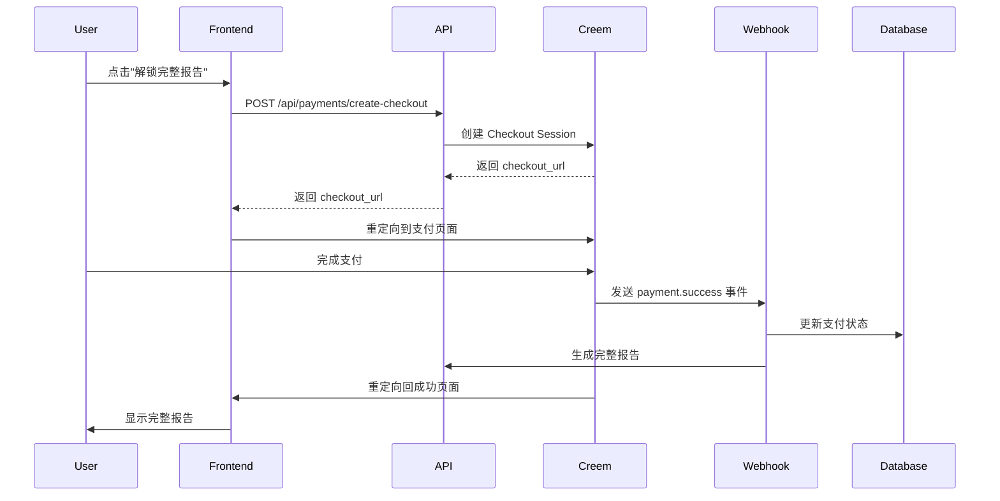

# Creem 支付集成完整指南

## 📋 概述

本项目已完整集成 Creem 支付系统，支持一次性付费解锁完整命理报告。

## 🚀 快速开始

### 1. 创建 Creem 账户

访问 [Creem.io](https://creem.io) 并创建账户。

### 2. 创建产品

1. 进入 [Products 页面](https://creem.io/dashboard/products)
2. 点击 "Add Product"
3. 填写产品信息：
   - **名称**: "完整命理报告解锁"
   - **描述**: "解锁您的完整八字命理分析报告，获得深度的人生洞察"
   - **价格**: 建议 $19.99 或 ¥128
   - **Success URL**: `https://your-domain.com/payment/success`
   - 可选：上传产品图片
4. 保存后，复制 **Product ID** (格式: `prod_xxxxx`)

### 3. 获取 API Key

1. 进入 [Developers 页面](https://creem.io/dashboard/developers)
2. 复制你的 **Test API Key** 和 **Live API Key**
3. Test Key 格式: `creem_test_xxxxx`
4. Live Key 格式: `creem_live_xxxxx`

### 4. 配置环境变量

复制 `.env.local.example` 为 `.env.local`:

```bash
cp .env.local.example .env.local
```

编辑 `.env.local` 并填入你的凭证：

```env
# Creem Configuration
CREEM_API_KEY=creem_live_your_actual_key
CREEM_API_KEY_TEST=creem_test_your_actual_key
CREEM_MODE=test  # 开发时使用 'test'，生产环境改为 'live'
CREEM_PRODUCT_ID=prod_your_actual_product_id

# 其他配置...
```

### 5. 配置 Webhook

#### 开发环境（使用 ngrok）

1. 安装 ngrok: `npm install -g ngrok`
2. 启动应用: `npm run dev`
3. 在另一个终端运行: `ngrok http 3000`
4. 复制 ngrok URL (例如: `https://xxxx.ngrok.io`)
5. 在 [Creem Webhook 设置](https://creem.io/dashboard/developers) 中添加:
   - Test Webhook URL: `https://xxxx.ngrok.io/api/payments/webhook`

#### 生产环境

在 Creem Dashboard 中添加:
- Live Webhook URL: `https://your-domain.com/api/payments/webhook`

### 6. 启动应用

```bash
npm install
npm run dev
```

## 💰 支付流程

### 用户视角

1. **生成预览报告** (免费)
   - 用户填写出生信息
   - 系统生成 500-800 字的预览报告
   - 用户可以查看部分内容

2. **解锁完整报告** (付费)
   - 点击 "解锁完整报告" 按钮
   - 跳转到 Creem 支付页面
   - 完成支付（支持多种支付方式）
   - 自动跳转回应用
   - 立即查看完整报告

### 技术流程



## 🔧 API 端点

### 1. 创建支付会话

**POST** `/api/payments/create-checkout`

请求体:
```json
{
  "reportId": "report_id_here",
  "requestId": "optional_tracking_id"
}
```

响应:
```json
{
  "success": true,
  "checkoutUrl": "https://checkout.creem.io/...",
  "checkoutId": "ch_xxxxx"
}
```

### 2. 验证支付

**GET** `/api/payments/verify?checkout_id=ch_xxxxx`

响应:
```json
{
  "success": true,
  "isPaid": true,
  "orderId": "ord_xxxxx"
}
```

### 3. Webhook 处理

**POST** `/api/payments/webhook`

由 Creem 自动调用，处理支付成功事件。

## 🔐 安全性

### 1. 签名验证

所有返回 URL 都包含 `signature` 参数，需要验证：

```typescript
import crypto from 'crypto'

function verifySignature(params: Record<string, string>, signature: string): boolean {
  const apiKey = process.env.CREEM_API_KEY!
  const sortedParams = Object.keys(params)
    .filter(key => key !== 'signature')
    .sort()
    .map(key => `${key}=${params[key]}`)
    .join('&')
  
  const expectedSignature = crypto
    .createHmac('sha256', apiKey)
    .update(sortedParams)
    .digest('hex')
  
  return signature === expectedSignature
}
```

### 2. Webhook 安全

- 验证请求来自 Creem
- 使用 HTTPS
- 实现幂等性（防止重复处理）
- 记录所有 webhook 事件

### 3. 数据保护

- API Key 存储在环境变量中
- 从不在前端暴露 Secret Key
- 使用 Supabase RLS 保护数据库

## 📊 数据库结构

### payments 表

```sql
CREATE TABLE payments (
  id UUID PRIMARY KEY DEFAULT uuid_generate_v4(),
  user_id UUID NOT NULL REFERENCES auth.users(id),
  report_id UUID NOT NULL REFERENCES user_reports(id),
  checkout_id TEXT UNIQUE NOT NULL,
  order_id TEXT,
  customer_id TEXT,
  amount DECIMAL(10, 2) NOT NULL,
  currency TEXT DEFAULT 'USD',
  status TEXT DEFAULT 'pending', -- pending, completed, failed, refunded
  payment_provider TEXT DEFAULT 'creem',
  metadata JSONB,
  created_at TIMESTAMP WITH TIME ZONE DEFAULT NOW(),
  updated_at TIMESTAMP WITH TIME ZONE DEFAULT NOW()
);
```

## 🧪 测试

### 测试模式

在 `.env.local` 中设置:
```env
CREEM_MODE=test
CREEM_API_KEY=creem_test_xxxxx
```

### 测试支付

1. 使用测试模式创建支付
2. 在 Creem 支付页面使用测试支付方式
3. 验证 webhook 接收
4. 确认报告已解锁

### 测试 Webhook

使用 Creem Dashboard 的 "Test Webhook" 功能发送测试事件。

## 🚨 错误处理

### 常见错误

1. **Invalid API Key**
   - 检查 `.env.local` 中的 API Key
   - 确认使用正确的模式（test/live）

2. **Product not found**
   - 检查 `CREEM_PRODUCT_ID` 是否正确
   - 确认产品在 Creem Dashboard 中存在

3. **Webhook not received**
   - 检查 webhook URL 是否可访问
   - 查看 Creem Dashboard 中的 webhook 日志
   - 确认使用 HTTPS（生产环境）

4. **Payment not completing**
   - 检查数据库连接
   - 查看服务器日志
   - 确认 webhook 端点正常工作

## 📈 监控和日志

### 查看支付记录

```sql
-- 查看所有支付
SELECT * FROM payments ORDER BY created_at DESC;

-- 查看成功的支付
SELECT * FROM payments WHERE status = 'completed';

-- 查看特定用户的支付
SELECT * FROM payments WHERE user_id = 'user_id_here';
```

### 日志位置

- 应用日志: 查看终端输出
- Webhook 日志: Creem Dashboard > Developers > Webhooks
- 数据库日志: Supabase Dashboard > Logs

## 🎯 定价建议

| 市场 | 价格 | 说明 |
|------|------|------|
| 国际 | $19.99 | 一次性解锁 |
| 中国 | ¥128 | 一次性解锁 |
| 优惠 | $14.99 | 限时促销 |

## 📞 支持

### Creem 支持
- 文档: https://docs.creem.io
- 支持: support@creem.io
- Dashboard: https://creem.io/dashboard

### 项目支持
如有问题，请查看:
1. 本文档
2. `.env.local.example`
3. 服务器日志
4. Creem Dashboard

## ✅ 上线检查清单

生产环境部署前确认：

- [ ] 已在 Creem 创建实际产品
- [ ] 已获取 Live API Key
- [ ] 已配置生产环境变量
- [ ] `CREEM_MODE=live`
- [ ] 已配置生产 Webhook URL
- [ ] 已测试完整支付流程
- [ ] 已启用 HTTPS
- [ ] 已配置正确的 Success URL
- [ ] 已设置错误监控
- [ ] 已准备客服支持

## 🔄 迁移现有用户

如果你有现有的免费用户，可以运行迁移脚本：

```bash
npm run migrate:users
```

这将：
1. 保留所有现有报告
2. 不影响已生成的预览报告
3. 用户可以随时付费解锁

## 📝 更新日志

### v1.0.0 (2025-10-15)
- ✅ 完整集成 Creem 支付 API
- ✅ 实现 Webhook 处理
- ✅ 添加签名验证
- ✅ 支持测试和生产模式
- ✅ 完整的错误处理
- ✅ 数据库支付记录

